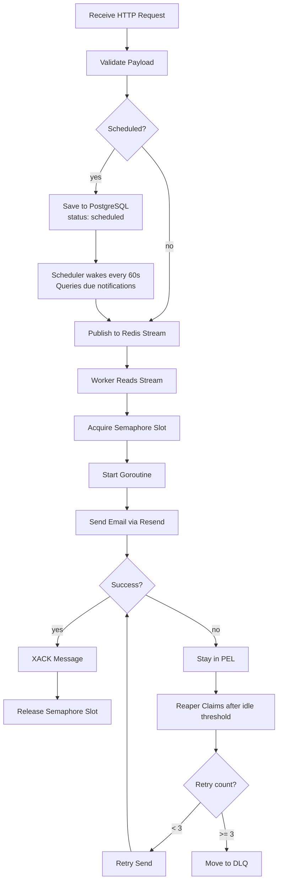

# Intunel

An event-driven notification service built with **Go, Redis Streams, and PostgreSQL**.

Intunel accepts notification requests through an HTTP API, queues them in Redis Streams, and processes them asynchronously using Redis Consumer Groups. Concurrency is controlled with a semaphore, while PostgreSQL handles scheduled notifications.

## Architecture

* **API** — Validates requests and publishes immediate notifications to Redis.
* **Redis Streams** — Message broker with Consumer Groups and reliable message processing.
* **Worker** — Processes notifications concurrently with a controlled goroutine limit.
* **Scheduler** — Publishes scheduled notifications when they become due.
* **PostgreSQL** — Durable storage for scheduled notifications.
* **Retry Reaper** — Recovers failed messages from the Redis Pending Entries List.
* **DLQ** — Stores messages that exhaust their retry attempts.
* **Resend** — Current email delivery provider.

### Processing Pipeline



## Key Features

### Asynchronous Notifications

Immediate notifications are published to Redis Streams instead of being sent directly from the API.

### Controlled Concurrency

Each notification runs in a goroutine, while a semaphore limits concurrent processing to **10 goroutines**.

### Retry & Dead Letter Queue

Failed messages remain in the Redis Pending Entries List and are recovered by the Reaper.

Retry schedule:

* Retry 1 — 1 minute
* Retry 2 — 5 minutes
* Retry 3 — Dead Letter Queue

### Scheduled Notifications

Clients provide a date, time, and IANA timezone such as `Africa/Lagos`. The API converts the time to UTC and stores the job in PostgreSQL.

The Scheduler checks for due jobs every 60 seconds and publishes them to Redis.

### Idempotency

Every notification request requires an `Idempotency-Key`.

Keys are stored in Redis for **24 hours**, preventing duplicate notifications when clients retry the same request.

## Running Locally

### Docker

```bash
docker compose up --build
```

or

```bash
docker-compose up
```

<br><br>

API:

```text
http://localhost:8080
```

### Without Docker

Start Redis, then run the API and worker separately:

```bash
go run ./cmd/api
go run ./cmd/worker
```

## API

**Live API:** https://intunel-api.onrender.com

### Immediate Notification

```http
POST /api/v1/notify
Content-Type: application/json
Idempotency-Key: 550e8400-e29b-41d4-a716-446655440000
```

```json
{
  "channel": "email",
  "to": "john@example.com",
  "title": "Welcome",
  "body": "<h1>Welcome to our platform!</h1>"
}
```

### Scheduled Notification

```json
{
  "channel": "email",
  "to": "john@example.com",
  "title": "Trial ending soon",
  "body": "<h1>Your trial ends tomorrow</h1>",
  "date": "2026-07-21",
  "time": "09:00:00",
  "timezone": "Africa/Lagos"
}
```

Scheduled notifications are converted to UTC, stored in PostgreSQL, and published to Redis when their scheduled time is reached.

## Technologies

* Go
* Redis Streams
* Redis Consumer Groups
* PostgreSQL
* GORM
* Goroutines & Channels
* Semaphore Pattern
* Resend
* Docker
* Idempotency
* Dead Letter Queue
